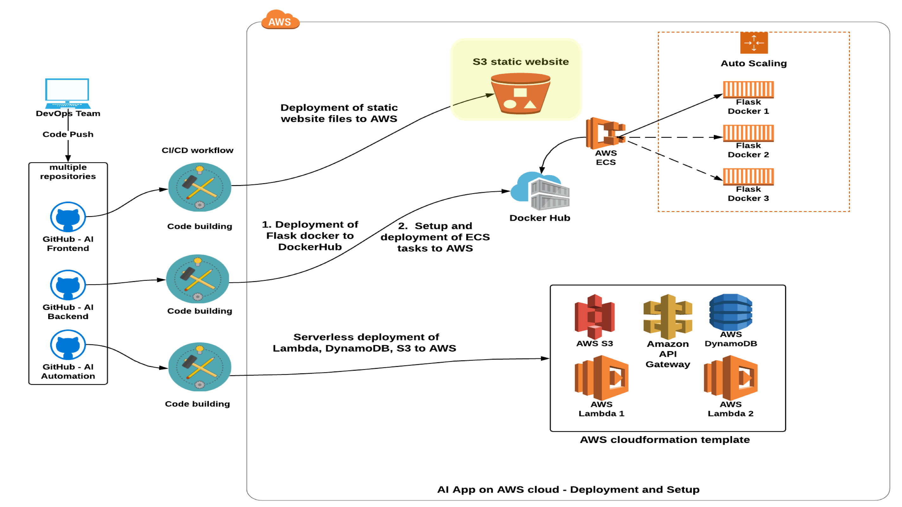

# Udacity Bertelsmann Technical Scholarship Cloud Track Challenge Project - Deploy An AI Sentiment Prediction App to AWS Cloud
 ---
#### _The project was created by 3 scholars from the Cloud Track Challenge_

* [Adrik S](https://github.com/Adriks976) (France)
* [Audrey ST](https://github.com/atan4583) (Australia)
* [Christopher R](https://github.com/christopherrauh) (Germany).

### Repo Information

> * this repo contains the project website static files **_index.html_** and **_app.js_**
>
> * the files reside in the **_static_** folder
>
> *   on push to master branch, CI/CD Action on this repo copies the files to the S3 bucket hosting the project website on AWS

### CI/CD Action
> * triggered on push to master branch
>
> * workflow file: .github/workflows/aws.yml
>
> * enviroment variables
>     - **AWS_S3_BUCKET**: s3 bucket **_ai-frontend_**
>
>     - **AWS_ACCESS_KEY_ID**: access-key-id of iam user **_sc-frontend_**
>
>     - **AWS_SECRET_ACCESS_KEY**: secret-access-key of iam user **_sc-frontend_**
>
>     - AWS_REGION: 'us-west-2'   (default: 'us-east-1')
>
>     - SOURCE_DIR: 'static'      (default: entire repo)
>
> * environment variables in **bold** are required variables and stored in **Settings/Secrets**
>
