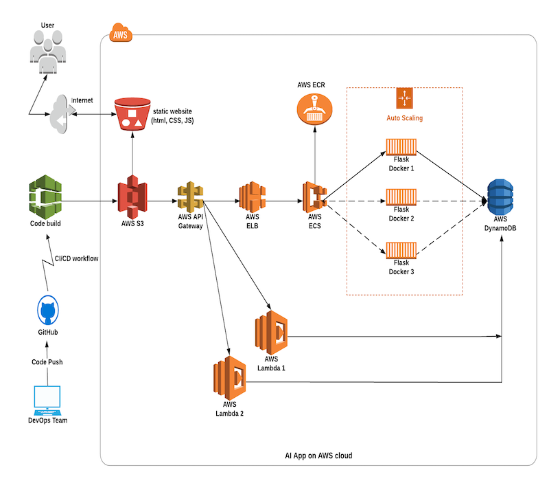
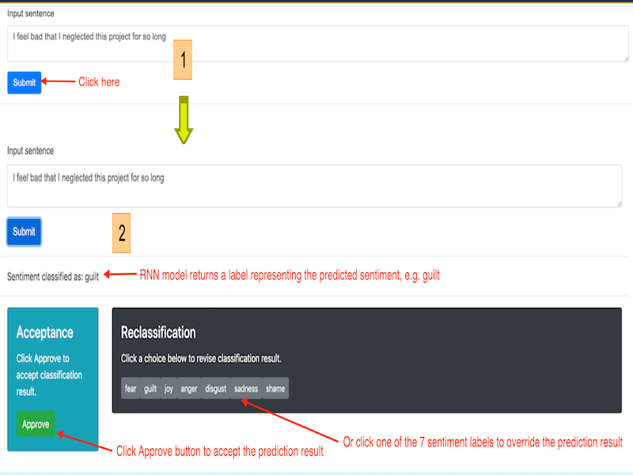
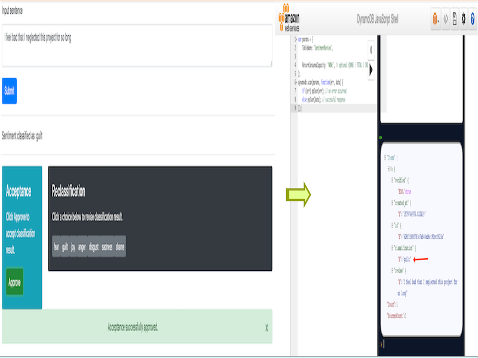
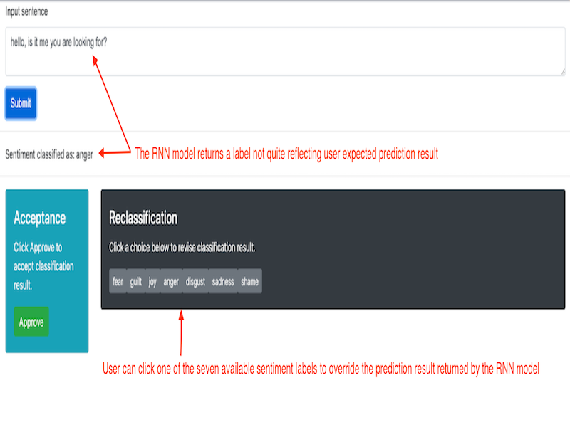
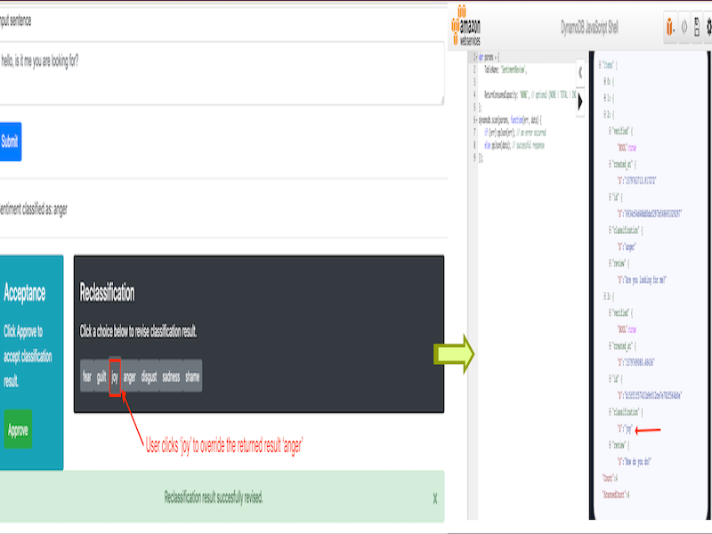
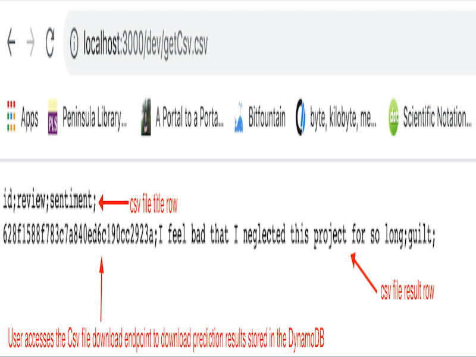
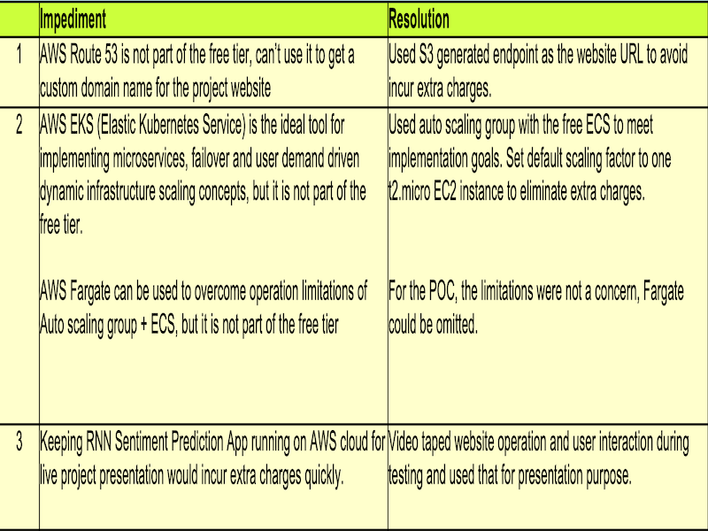

# Udacity Bertelsmann Technical Scholarship Cloud Track Challenge Project - Deploy An AI Sentiment Prediction App to AWS Cloud
This repo is 1 of the 3 repos of the project and contains the static website files of project website.
 ---
#### _The project was created by 3 scholars from the Cloud Track Challenge_

## Project Information
The project transforms the original infrastructure of a RNN sentiment prediction app to an AWS cloud deployable infrastructure.

**Project Goals**: Implements various AWS cloud stack concepts covered in Phase I of the scholoarship challenge, namely Lesson 12 thru 23, plus additional advanced concepts such as Serverless Framework, CI/CD, Docker, API Gateway, ECS, ECR, DynamoDB and Microservices.

**Project Team**: an international team with 3 members from Phase I of the Cloud Track Challenge: 
* [Adrik S](https://github.com/Adriks976) (France)
* [Audrey ST](https://github.com/atan4583) (Australia)
* [Christopher R](https://github.com/christopherrauh) (Germany).

### A RNN Sentiment Prediction App on AWS Cloud Infrastructure

#### Cloud Lesson Concepts Implemented
> * GitHub repositories (ai-frontend, ai-automation, ai-backend):  Lesson 1 - 12
>
> * AWS S3 Static Website: Lesson 14, 23
>
> * AWS Lambda function: Lesson 13
>
> * AWS Elastic Load Balancer: Lesson 16, 20
>
> * AWS Auto Scaling Group: Lesson 20
>
> * AWS Cloudformation: Lesson 19
>
> * AWS IAM: Lesson 15
>
 ---
#### Advanced Concepts Implemented
> * GitHub CI/CD workflow pipelines
>
> * AWS API Gateway
>
> * AWS ECS (elastic container service)
>
> * AWS ECR (elastic container registry)
>
> * Flask Docker (scaling between 1 to 3 instances)
>
> * AWS DynamoDB
>
> * AWS Serverless Framework
>
> * Microservices
>
>
### Workflows of the DevOps Model built on Serverless Framework and AWS Services
#### Workflow I
> * DevOps team merges feature branches to the master branch in 1 of the 3 GitHub repositories
>
> * Pushes to the relevant remote master branch
>
 ---
#### Workflow II
> * Code build process via 1 of the 3 build paths based on the repo receiving the push:
>
>  * If the push is onto **ai-frontend** repo, CI/CD Action **_Upload Website_** automatically runs to upload updated static files (index.html, app.js) to AWS S3 website **udacity-ai-frontend**
>
>  * If the push is onto **ai-backend** repo, CI/CD Action **_Deploy to Amazon ECS_** automatically runs to build a new Flask container to push to the ECR, then deploy a new task definition to the ECS on AWS cloud
>
>  * If the push is onto **ai-automation** repo, CI/CD Action automatically runs a serverless.yml file to generate and execute AWS cloudformation script, and trigger rebuilding of the S3 website. This entails invoking an AWS API Gateway to sync up AWS lambda functions, preparing DynamoDB, etc, so as to apply the changes pushed onto this Github repo
>
 ---
#### Workflow III
> * Sentiment Prediction App Usage Scenarios
>
>  * User submits a sentiment prediction request thru S3 website **udacity-ai-frontend** and receives a prediction result
>
>     - User approves the prediction result, the approved result is written to the DynamoDB
>
>     - User revises the prediction result, the revised result is written to the DynamoDB
>
>  * User downloads prediction results in the DynamoDB as a CSV (This will be used as a new dataset for re-training of the RNN model)
>
 ---
#### Workflow IV
> * Depending on user usage demands on Sentiment Prediction App, AWS ECS and Auto Scaling group orchestrate to scale up to 3 Flask container instances to optimize workload distribution and app response time
>
>
### RNN Sentiment Prediction App Use Case Demo
#### Scenario I

> 1. User enters a text in the web UI and click Submit to get a sentiment prediction result
>
> 2. The model returns a label (e.g. guilt) representing the predicted sentiment, which user can approve or revise
>

> 3. User clicks Approve button to accept the prediction result. The result is recorded to the DynamoDB
>
  ---
#### Scenario II

> 1. The RNN model prediction result returned does not quite met the user’s expectation. The user can click 1 of the 7 available label to override the returned result
>

> 2. User clicks ‘joy’ label to override the returned result ‘anger’. The revised result is recorded to the DynamoDB
>
 ---
#### Scenario III

> User accesses the Csv file download endpoint to download prediction results stored in the DynamoDB. This csv file can then be used as a new dataset for retraining the RNN Sentiment Prediction model.
>
>
### Implementation Impediments and Resolutions
This is a POC (proof of concept) project the project team put together to implement and practice basic cloud DevOps concepts from this phase I Challenge and experiment advanced concepts nominated by team members.

The project was 100% unfunded and utilized AWS free-tier account to conduct the POC. The impediments experienced during the implementation and resolutions are listed below:

